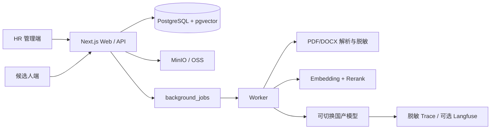

# 架构与数据流

## 运行状态与故障恢复

`/health` 在登录后检查 PostgreSQL、对象存储、本地 RAG 服务、评分 Worker、评测 Worker、模型配置与发信配置。两个 Worker 每 10 秒写入一次不含业务数据的心跳；超过 45 秒未更新即提示不可用。

评分任务统一使用 `queued / running / succeeded / failed / cancelled` 状态。运行超过 10 分钟会自动失败，保留简历、面试记录与旧结果并允许重试。运行日志只记录任务 ID、阶段、耗时和错误代码，不记录简历、联系方式、面试原文或模型输入。

Web 处理授权、短请求和人工确认；Worker 处理解析、向量化和批量评测。PostgreSQL 保存业务真相与向量，原文件只进对象存储。MinIO 与 OSS 通过同一 S3-compatible 接口切换。所有写操作带组织和对象作用域，耗时任务以幂等键去重。
